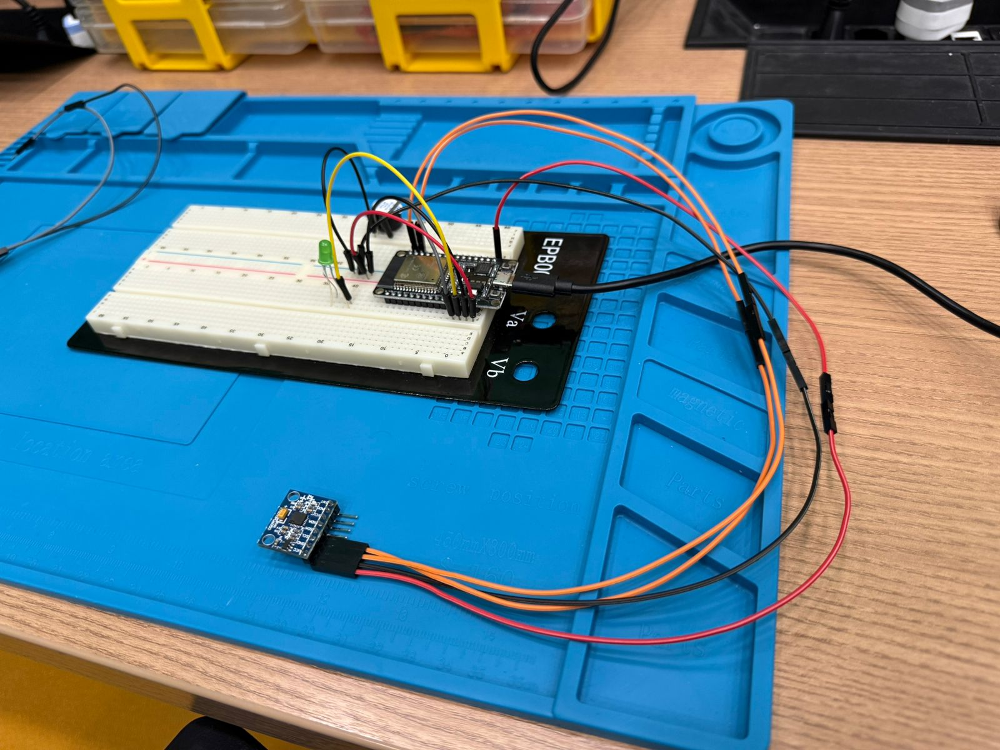
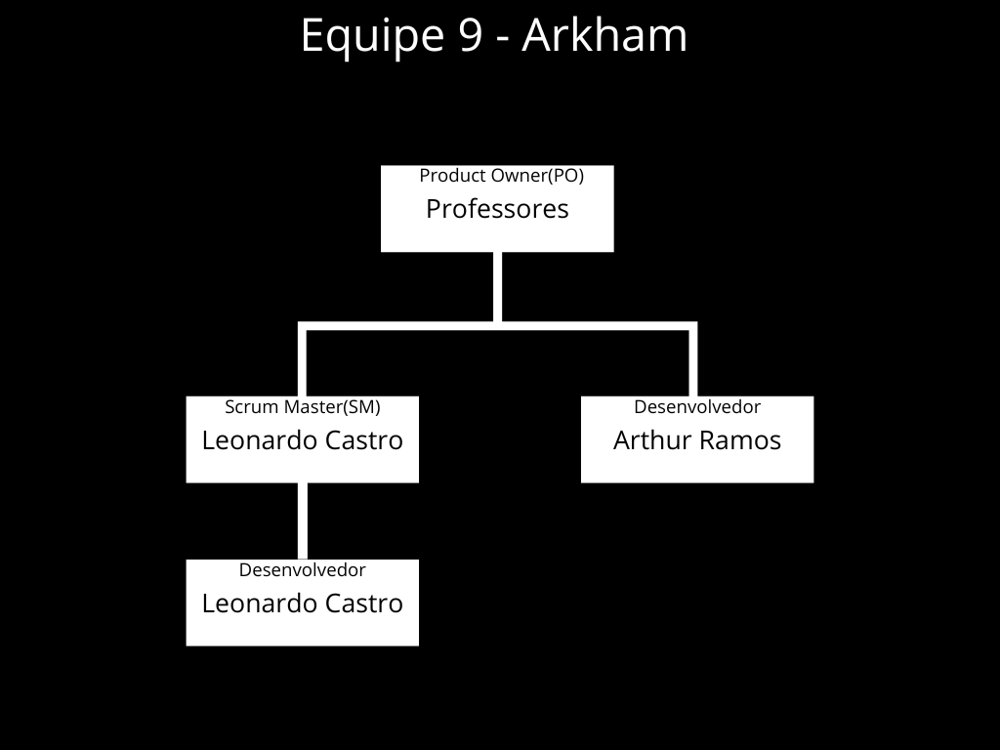

#  MIC_Hands_on_Arthur_Ramos_Leonardo_Castro

**Componentes**: [Leonardo Castro](https://github.com/thetwelvedev) e [Arthur Ramos](https://github.com/ArthurRamos26)

## Sumário

- [ MIC\_Hands\_on\_Arthur\_Ramos\_Leonardo\_Castro](#-mic_hands_on_arthur_ramos_leonardo_castro)
  - [Sumário](#sumário)
  - [Hands-on básico](#hands-on-básico)
  - [Projeto Montado](#projeto-montado)
  - [Artefatos](#artefatos)
      - [Repositório](#repositório)
      - [Slide do Pitch](#slide-do-pitch)
      - [Plano de Teste](#plano-de-teste)
      - [Big Picture](#big-picture)
      - [Diagrama Esquemático das Conexões e componentes do projeto](#diagrama-esquemático-das-conexões-e-componentes-do-projeto)
      - [Documento de Definição de Pronto(DoD)](#documento-de-definição-de-prontodod)
      - [Imagens do Trello com o projeto finalizado](#imagens-do-trello-com-o-projeto-finalizado)
      - [Documento de requesitos Funcionais](#documento-de-requesitos-funcionais)
  - [Organograma](#organograma)
  - [Código do Circuito](#código-do-circuito)


## Hands-on básico

- [x] Sprint 0
- [x] Sprint 1
- [x] Sprint 2
- [ ] Pitch do projeto

## Projeto Montado


## Artefatos

#### Repositório
**Link**: https://github.com/ArthurRamos26/MIC_Hands_on_Arthur_Ramos_Leonardo_Castro

#### Slide do Pitch
[Acesse aqui](./Artefatos/Slide%20Pitch.pdf)

#### Plano de Teste
[Acesse aqui](./Artefatos/plano_de_teste_equipe_09.pdf)

#### Big Picture


#### Diagrama Esquemático das Conexões e componentes do projeto
[Acesse aqui](./Artefatos/Diagrama%20Esquemático%20das%20Conexões_Equipe_09.pdf)

#### Documento de Definição de Pronto(DoD)
[Acesse aqui](./Artefatos/Definição%20de%20Pronto%20(DoD)_equipe_09.pdf)

#### Imagens do Trello com o projeto finalizado
[Acesse aqui](./Artefatos/Trello%20Finalizado_Equipe_09.pdf)

#### Documento de requesitos Funcionais
[Acesse aqui](./Artefatos/Requisitos_Funcionais_equipe_09.pdf)

## Organograma


## Código do Circuito
```C
#include <Wire.h>
#include <MPU6050.h>

MPU6050 mpu;

const int ledPin = 13;   // Pino do LED
const int buzzerPin = 12; // Pino do Buzzer

// Definindo o limite de inclinação (em graus)
const float angleThreshold = 30.0; //Inlinação acima de 20-30 graus pode sobrecarregar o pescoço por exemplo

void setup() {
  Serial.begin(115200);
  
  // Inicializa a comunicação I2C
  Wire.begin(22, 23);  // Pinos SDA e SCL definidos

  // Inicializa o sensor MPU6050
  mpu.initialize();
  
  // Configura os pinos do LED e buzzer
  pinMode(ledPin, OUTPUT);
  pinMode(buzzerPin, OUTPUT);

  // Testa a conexão do MPU6050
  if (!mpu.testConnection()) {
    Serial.println("MPU6050 não está conectado!");
    while (1);
  }

  Serial.println("MPU6050 Conectado!");
}

void loop() {
  // Variáveis para armazenar os dados de aceleração
  int16_t ax, ay, az;
  int16_t gx, gy, gz;
  
  // Lê os dados do sensor MPU6050
  mpu.getMotion6(&ax, &ay, &az, &gx, &gy, &gz);

  // Calcular o ângulo de inclinação com base na aceleração
  float angleX = atan2(ay, az) * 180.0 / PI;  // Inclinação no eixo X
  float angleY = atan2(ax, az) * 180.0 / PI;  // Inclinação no eixo Y

  // Exibir os valores de ângulo no monitor serial
  Serial.print("Angle X: ");
  Serial.print(angleX);
  Serial.print("  Angle Y: ");
  Serial.println(angleY);

  // Lógica para verificar postura
  if (abs(angleY) > (angleThreshold + 90)) {
    // Postura incorreta
    digitalWrite(ledPin, HIGH); // Ativa o LED
    digitalWrite(buzzerPin, HIGH); // Ativa o Buzzer
    Serial.println("Postura incorreta! Corrija sua postura.");
  } else {
    // Postura correta
    digitalWrite(ledPin, LOW);  // Desativa o LED
    digitalWrite(buzzerPin, LOW);  // Desativa o Buzzer
    Serial.println("Postura correta!");
  }
  
  delay(1000); // Atraso de 1000ms antes da próxima leitura
}

```